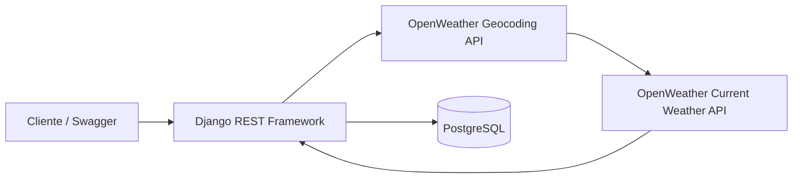

# GnTech Weather API

[](https://github.com/leandropiassetta/gntech-weather-api/actions/workflows/ci.yml)

API REST desenvolvida como parte do desafio técnico para a posição de
Desenvolvedor de Software Pleno da GnTech.

A aplicação recebe uma cidade, consulta o clima atual no OpenWeather, normaliza
os dados e armazena cada observação no PostgreSQL. As leituras persistidas podem
ser consultadas posteriormente por endpoints REST paginados.

## Arquitetura



O fluxo de coleta utiliza duas chamadas externas:

1. Converte cidade e país em latitude e longitude.
2. Consulta o clima atual pelas coordenadas obtidas.
3. Valida e persiste a leitura em uma transação curta.
4. Retorna o registro criado com status `201`.

As chamadas externas acontecem antes da transação, evitando manter uma
transação de banco aberta enquanto a aplicação espera pela rede.

## Tecnologias

- Python 3.12
- Django 5.2 LTS e Django REST Framework
- PostgreSQL 17
- OpenWeather Geocoding e Current Weather APIs
- drf-spectacular (OpenAPI e Swagger UI)
- Gunicorn
- Docker e Docker Compose
- pytest, pytest-django e Ruff
- GitHub Actions

## Pré-requisitos

Para a execução recomendada são necessários:

- Docker com o comando `docker compose` disponível;
- uma chave gratuita do [OpenWeather](https://openweathermap.org/api).

Não é necessário instalar Python ou PostgreSQL no computador quando o projeto
é executado com Docker.

## Execução com Docker

### 1. Preparar o projeto

Clone o repositório e entre no diretório:

```bash
git clone https://github.com/leandropiassetta/gntech-weather-api.git
cd gntech-weather-api
```

Crie o arquivo local de configuração:

```bash
cp .env.example .env
```

### 2. Obter uma chave do OpenWeather

O endpoint de coleta consulta as APIs de Geocoding e Current Weather. Por isso,
o servidor precisa de uma chave pessoal do OpenWeather. Quem consome esta API
não precisa conhecer ou enviar essa chave.

1. [Crie uma conta no OpenWeather](https://home.openweathermap.org/users/sign_up)
   ou entre em uma conta existente.
2. Confirme o endereço de e-mail usado no cadastro.
3. Abra a aba [API keys](https://home.openweathermap.org/api_keys) da conta.
4. Use a chave `Default` ou informe um nome e selecione **Generate** para criar
   outra chave.
5. Copie o valor da coluna **Key**. A coluna **Name** é somente um rótulo e não
   deve ser colocada no `.env`.
6. Aguarde a ativação. Uma chave nova pode levar até duas horas para funcionar,
   mesmo quando já aparece como `Active` no painel.

O acesso gratuito contempla os dois serviços usados pelo projeto. Consulte as
[instruções oficiais sobre APPID](https://openweathermap.org/appid) para mais
detalhes.

### 3. Configurar o `.env`

Edite o `.env` localizado na raiz do projeto e substitua, no mínimo:

```dotenv
DJANGO_SECRET_KEY=uma-chave-local-longa-e-aleatoria
OPENWEATHER_API_KEY=cole-aqui-o-valor-da-coluna-key
```

Não adicione `appid=`, não use o nome atribuído à chave e não inclua espaços ao
redor do valor. O `.env` é ignorado pelo Git e nunca deve ser versionado.

Uma chave para o Django pode ser gerada com:

```bash
python3 -c 'import secrets; print(secrets.token_urlsafe(50))'
```

### 4. Validar a chave do OpenWeather

Este teste é opcional, mas ajuda a identificar problemas de ativação antes de
iniciar a aplicação. Execute-o na raiz do projeto:

```bash
set -a
source .env
set +a

curl --get 'https://api.openweathermap.org/geo/1.0/direct' \
  --data-urlencode 'q=Florianópolis,BR' \
  --data-urlencode 'limit=1' \
  --data-urlencode "appid=${OPENWEATHER_API_KEY}"
```

Uma chave funcional retorna uma lista contendo Florianópolis, suas coordenadas
e o código `BR`. Uma resposta `401` indica que a chave está incorreta, ainda não
foi ativada ou a conta ainda não teve o e-mail confirmado. Confira o valor na
aba **API keys** e, para chaves novas, aguarde até duas horas.

### 5. Iniciar a aplicação

Inicie a API e o PostgreSQL:

```bash
docker compose up --build -d
```

As migrations são aplicadas automaticamente. Quando os healthchecks estiverem
saudáveis, os serviços estarão disponíveis em:

| Recurso | Endereço |
| --- | --- |
| Swagger UI | <http://localhost:8000/api/docs/> |
| Schema OpenAPI | <http://localhost:8000/api/schema/> |
| API | <http://localhost:8000/api/v1/weather-readings/> |
| Healthcheck | <http://localhost:8000/health/> |

Confira o estado dos containers com:

```bash
docker compose ps
```

Se a chave for alterada depois que a aplicação já estiver em execução, recrie
o container da API para carregar o novo valor:

```bash
docker compose up -d --force-recreate api
```

Usar apenas `docker compose restart` não recarrega as variáveis do `.env`.

Se a porta 8000 já estiver ocupada, altere `API_PORT` no `.env`, por exemplo:

```dotenv
API_PORT=8001
```

Nesse caso, use `http://localhost:8001` nos endereços e exemplos desta
documentação.

### 6. Fazer a primeira coleta pelo Swagger

1. Abra <http://localhost:8000/api/docs/>.
2. Expanda `POST /api/v1/weather-readings/`.
3. Selecione **Try it out**.
4. Informe o corpo abaixo e selecione **Execute**:

```json
{
  "city": "Florianópolis",
  "country_code": "BR"
}
```

Uma coleta bem-sucedida retorna `201 Created` e salva a observação no
PostgreSQL. A chave do OpenWeather não deve ser enviada no corpo, nos headers ou
no Swagger; o servidor a lê do `.env` e acrescenta o parâmetro `appid` às
chamadas externas.

Para encerrar os containers sem apagar os dados:

```bash
docker compose down
```

Para apagar também o volume do PostgreSQL:

```bash
docker compose down --volumes
```

> Esse último comando remove definitivamente todas as leituras armazenadas no
> ambiente Docker local.

## Variáveis de ambiente

| Variável | Uso | Exemplo/padrão |
| --- | --- | --- |
| `DJANGO_SECRET_KEY` | Segredo criptográfico obrigatório do Django | sem padrão |
| `DJANGO_DEBUG` | Ativa o modo de desenvolvimento | `False` |
| `DJANGO_ALLOWED_HOSTS` | Hosts aceitos, separados por vírgula | `localhost,127.0.0.1` |
| `DJANGO_LOG_LEVEL` | Nível dos logs da aplicação | `INFO` |
| `API_PORT` | Porta publicada pelo Compose | `8000` |
| `POSTGRES_DB` | Nome do banco | obrigatório |
| `POSTGRES_USER` | Usuário do banco | obrigatório |
| `POSTGRES_PASSWORD` | Senha do banco | obrigatório |
| `POSTGRES_HOST` | Host do banco; o Compose substitui por `db` | obrigatório |
| `POSTGRES_PORT` | Porta do PostgreSQL | `5432` |
| `OPENWEATHER_API_KEY` | Chave usada somente no servidor | sem padrão |
| `OPENWEATHER_TIMEOUT_SECONDS` | Timeout de cada chamada ao provedor | `5` |

O `.env.example` contém apenas valores de desenvolvimento e placeholders. O
arquivo `.env` é ignorado pelo Git e não deve ser versionado.

## Endpoints

| Método | Endpoint | Descrição |
| --- | --- | --- |
| `POST` | `/api/v1/weather-readings/` | Consulta o OpenWeather e salva uma leitura |
| `GET` | `/api/v1/weather-readings/` | Lista leituras, 20 por página |
| `GET` | `/api/v1/weather-readings/?city=...&country_code=...` | Filtra por cidade e país |
| `GET` | `/api/v1/weather-readings/{id}/` | Consulta uma leitura específica |
| `GET` | `/health/` | Verifica API e PostgreSQL |
| `GET` | `/api/schema/` | Retorna o documento OpenAPI |
| `GET` | `/api/docs/` | Abre o Swagger UI |

### Coletar uma leitura

```bash
curl --request POST http://localhost:8000/api/v1/weather-readings/ \
  --header 'Content-Type: application/json' \
  --data '{
    "city": "Florianópolis",
    "country_code": "BR"
  }'
```

Exemplo de resposta:

```json
{
  "id": 1,
  "requested_city": "Florianópolis",
  "city": "Florianópolis",
  "state": "Santa Catarina",
  "country_code": "BR",
  "provider_location_id": 3463237,
  "latitude": "-27.596900",
  "longitude": "-48.549500",
  "temperature": "22.80",
  "feels_like": "23.10",
  "humidity": 78,
  "pressure": 1015,
  "condition": "Clouds",
  "description": "nublado",
  "wind_speed": "4.20",
  "observed_at": "2026-09-22T12:00:00Z",
  "created_at": "2026-09-22T12:00:05Z"
}
```

O código do país deve possuir duas letras. Ele é normalizado para maiúsculas
antes da consulta.

### Listar e filtrar leituras

```bash
curl http://localhost:8000/api/v1/weather-readings/
```

```bash
curl --get http://localhost:8000/api/v1/weather-readings/ \
  --data-urlencode 'city=Florianópolis' \
  --data-urlencode 'country_code=BR'
```

```bash
curl 'http://localhost:8000/api/v1/weather-readings/?page=2'
```

A listagem é ordenada da observação mais recente para a mais antiga e utiliza o
formato paginado:

```json
{
  "count": 1,
  "next": null,
  "previous": null,
  "results": []
}
```

### Consultar uma leitura

```bash
curl http://localhost:8000/api/v1/weather-readings/1/
```

## Respostas de erro

| Status | Situação |
| --- | --- |
| `400` | Cidade, país ou filtro inválido |
| `404` | Localização, leitura ou página não encontrada |
| `502` | Timeout, indisponibilidade ou resposta inválida do OpenWeather |
| `503` | Chave ausente/inválida ou limite do OpenWeather atingido |

Erros comuns durante a configuração da chave:

| Código da resposta | Causa provável | Como resolver |
| --- | --- | --- |
| `weather_provider_not_configured` | `OPENWEATHER_API_KEY` ausente ou vazia | Preencha a variável no `.env` e recrie o container da API |
| `weather_provider_authentication_failed` | Chave incorreta ou ainda não ativada | Teste a chave diretamente, confirme o e-mail e aguarde a ativação |
| `weather_provider_rate_limited` | Limite de requisições atingido | Aguarde o período indicado pelo header `Retry-After` |
| `weather_provider_invalid_response` | Resposta inesperada do provedor | Consulte os logs e tente novamente |

Falhas da integração utilizam um corpo estável e não expõem chave, traceback ou
resposta interna do provedor:

```json
{
  "code": "weather_provider_unavailable",
  "detail": "The weather provider is unavailable."
}
```

Quando disponível, o `503` causado por rate limit também devolve o header
`Retry-After` recebido do OpenWeather. Nenhum registro é salvo quando a coleta
falha.

## Testes e qualidade

Com os containers em execução, a suíte pode ser executada sem instalar
dependências no host:

```bash
docker compose exec api python manage.py test weather
```

Para desenvolvimento local com Python, crie o ambiente e instale as
dependências de desenvolvimento:

```bash
python3.12 -m venv .venv
source .venv/bin/activate
python -m pip install -r requirements-dev.txt
```

Com um PostgreSQL local configurado conforme o `.env`, execute:

```bash
pytest
ruff check .
ruff format --check .
python manage.py makemigrations --check --dry-run
python manage.py spectacular \
  --file /tmp/openapi-schema.yaml \
  --validate \
  --fail-on-warn
```

Os testes mockam integralmente o OpenWeather. A suíte não consome cota da chave
e não depende da internet.

O workflow do GitHub Actions executa lint, formatação, checks do Django,
migrations, validação do OpenAPI, testes contra PostgreSQL e build do Dockerfile
a cada push ou pull request.

## Execução sem Docker

Além do ambiente Python descrito acima, crie o banco e usuário definidos no
`.env`. Em seguida:

```bash
python manage.py migrate
python manage.py runserver
```

Nesse modo, `POSTGRES_HOST` normalmente deve permanecer como `localhost`. No
Compose, esse valor é substituído automaticamente pelo hostname interno `db`.

## Inspeção do banco

O PostgreSQL não é publicado para a rede do host. Para abrir o `psql` pelo
container:

```bash
docker compose exec db sh -c 'psql -U "$POSTGRES_USER" -d "$POSTGRES_DB"'
```

Consulta de exemplo:

```sql
SELECT id, city, country_code, temperature, observed_at
FROM weather_readings
ORDER BY observed_at DESC;
```

## Estrutura do projeto

```text
config/                 configurações e rotas principais do Django
weather/
├── migrations/         evolução do schema PostgreSQL
├── services/           cliente OpenWeather e serviço de coleta
├── tests/              testes de modelo, integração e API
├── models.py           entidade WeatherReading
├── serializers.py      contratos de entrada e saída
├── urls.py              rotas da aplicação
└── views.py             endpoints REST e healthcheck
.github/workflows/      pipeline de integração contínua
docker/entrypoint.sh    espera do banco e aplicação das migrations
compose.yaml            API e PostgreSQL
Dockerfile              imagem de execução não-root
```

## Decisões técnicas

- **Django e DRF:** aderência direta à stack solicitada na vaga.
- **Geocodificação separada:** evita a busca por cidade embutida no endpoint de
  clima, marcada como obsoleta pelo OpenWeather.
- **`POST` para coleta:** consultar o provedor e salvar um registro altera o
  estado da aplicação; por isso a operação não utiliza `GET`.
- **Uma tabela:** suficiente para demonstrar modelagem relacional sem aumentar
  artificialmente a complexidade do desafio.
- **Histórico de leituras:** cada coleta gera um novo registro; não há
  deduplicação intencional.
- **UTC e sistema métrico:** datas são armazenadas com timezone e valores
  climáticos utilizam Celsius e metros por segundo.
- **Integração isolada:** views não conhecem detalhes HTTP do OpenWeather e os
  testes substituem o cliente externo por mocks.

## Configuração para acesso remoto

A imagem já executa a aplicação com Gunicorn em `0.0.0.0:8000`. Para hospedar em
um servidor ou plataforma de containers:

1. defina `DJANGO_DEBUG=False`;
2. gere um `DJANGO_SECRET_KEY` exclusivo;
3. configure `DJANGO_ALLOWED_HOSTS` com o domínio público;
4. forneça as credenciais de um PostgreSQL persistente;
5. forneça `OPENWEATHER_API_KEY` por secret/variável da plataforma;
6. publique a API atrás de HTTPS e de um proxy reverso.

O banco deve permanecer privado. Apenas a porta HTTP da API deve ser exposta.

## Limitações deliberadas

- A API criada não exige autenticação, conforme o escopo do desafio. Antes de
  exposição pública, seria necessário adicionar autenticação e throttling para
  proteger a cota do OpenWeather.
- A aplicação coleta somente o clima atual; não oferece previsões ou histórico
  fornecido pelo provedor.
- Não há frontend, cache ou processamento assíncrono.
